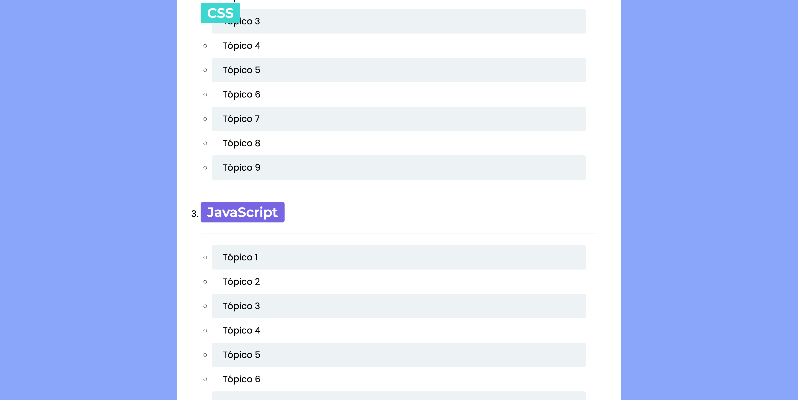

# Repositório do curso digital de CSS

## Código de Aula
Neste repositório encontra-se o código apresentado durante as aulas do curso digital, incluindo o início do projeto desenvolvido em aula, além de exercícios para fixação.
## Exercícios de Fixação do Curso Digital de CSS

### Exercício 6
Estilize a página de um sumário para se assemelhar ao modelo abaixo. Atente para os requistos principais:
- As cores de fundo dos tópicos devem se alternar entre a cor definida por --separator-color e #fff
- Utilize variáveis do CSS para colorir as tags de tecnologias e garanta que o 1º e 6º elementos tenham a cor definida na --tag-color-1, 2º e 7º com a --tag-color-2, 3º e 8º com a --tag-color-3 e assim por diante
- Garanta que a tag de tecnologia numerada fique fixa ao fazer scroll até encontrar a próxima (dica: use display sticky)

## Exercício 7
Adicione regras nos locais indicados do arquivo styles.css para fazer uma visualização em lista, cards ou destaques segundo as imagens abaixo:

- A visualização de lista deve ter apenas um item por linha e os itens devem ter espaçamento vertical de 2rem
- A visualização de cards deve ter 3 cards por linha de mesmo tamanho e os itens devem ter espaçamento horizontal e vertical de 5rem
- A visualização de destaques deve ter o primeiro e sexto elementos com tamanho maior até 4 vezes maior em relação a cards da mesma linha e os itens devem ter espaçamento horizontal e vertical de 5rem

### Exercício 8
Faça o layout mobile para a página da loja do exercício 7 da seguinte forma:
- Permita que apenas sejam selecionados os modos de visualização de cards e lista
- Na visão de cards devem ter 2 cards por linha
- Garanta que os botões para troca de visualização apareçam fixos no topo da tela com position fixed ou sticky 

### Exercício 9
Adicione apenas uma propriedade grid-template-areas na classe react-card sem fazer mais nenhuma modificação para deixar o layout similar à imagem abaixo:

### Exercício 10
Faça um *overlay* para esmaecer a imagem de capa abaixo, utilizando apenas 2 pseudoelementos para isso (::after e ::before), da seguinte forma:
- Overlay no ::before com fundo #000, opacidade 0.6 e cobrindo toda a imagem de capa
- Texto no ::after de cor #fff sem ser afetado pelo overlay, com conteúdo "O mundo como você nunca viu", largura máxima de 30rem, tamanho de 8rem, altura de linha 7rem e posicionado à 3rem da borda esquerda sobre o overlay e imagem.
- Faça uma animação para que o ícone da seta se desloque para baixo em 0.5rem e retorne para a posição inicial após 2 segundos 

